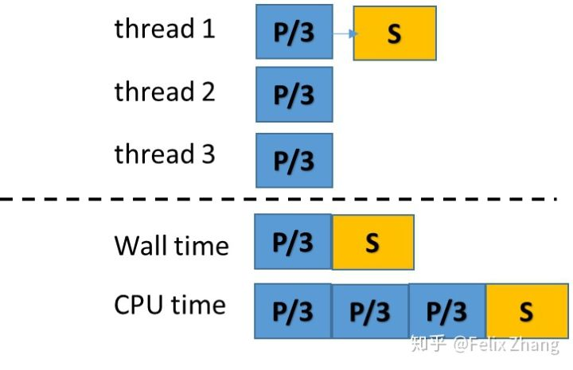
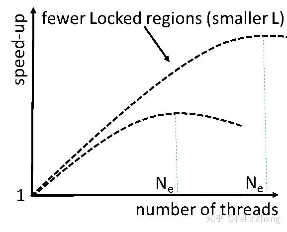

# 从Wall/CPU time理解多线程的并行的效率
作为高性能计算软件的用户，我们经常可以在软件的输出文件中看到各种时间统计。最常见的就是计算使用的时间，也就是wall-clock time或者wall time。这个很好理解，它就是我们从计算开始到计算结束等待的时间。除此之外，CPU time也是一个常见的时间数据。CPU time衡量的是CPU用来执行程序的时间。当软件使用一个线程时，由于需要等待IO完成或者用户输入等原因，CPU并不总是100%被使用，这导致CPU time一般比wall time小。当我们使用多线程的时候，程序的CPU time是各个线程的CPU time之和。

考虑最简单的情形。我们把一个多线程程序分为两个部分：可并行的部分和串行的部分。可并行的部分可以由多个线程同时执行从而降低用户等待的时间。而串行的部分只能由一个线程执行。如下图所示，我们使用3个线程，P代表的每个线程并行执行的时间，S代表的串行执行所需的时间。同时我们假设程序可并行的部分完全独立，不需要同步，并且可以理想的分配到各个线程，程序在运行过程中没有因为等待IO等原因被阻塞。

从图1中可以看出，这个多线程程序的Wall time， $ t_{wall}=P/3+S $ 。它的CPU time， $ t_{cpu}=P+S $ 。容易知道，如果使用一个线程， $ t_{wall} = t_{cpu}=P+S $ 。用户使用3个线程需要等待的时间（即wall time）和使用一个线程需要等待的时间之比为(P+S)/ (P/3+S)<3 。这也就是使用3个线程带来的加速比。

推广一下这个结论。假设程序可并行的部分是 a , 不可并行或者串行的部分 1-a ，那么用户使用 n 个线程带来的加速比是 1/(1-a+a/n) 。当 n 趋向无穷大时，加速比趋近于1/(1-a) 。可以看到，一个程序的串行部分决定了加速比的上限。这就是著名的Amdahl's law。

我们向实际情况更进一步。我们在程序的并行部分引入同步点。以有限元中对稀疏矩阵的组装为例，每个线程可以独立计算每个单元的刚度矩阵，但是把单元刚度矩阵组装到总体矩阵的时候就需要引入同步点，从而保证不会有多个线程在更新总体矩阵的同一个位置。这种同步可以使用锁(lock)的机制来实现。一个线程通过同步点需要的时间包括它获取锁的时间和执行同步点代码的时间。此处我们关心多个线程同时到达同步点的情形。在这种情况下，每个线程等待获取锁的时间随着线程数目的增加而增加。这种情形往往是造成多线程程序并行效率不高的一个主要原因，也往往是我们最关心的部分。在细粒度的多线程并行中，如果执行同步点代码所需要的时间很短，锁会以spinlock的形式来实现。在获取spinlock的过程中，CPU会不断的检查锁是否已经被别的线程释放。如果打开任务管理器，我们可以看到这个线程仍然在消耗着CPU time。和完全串行的程序相比，这个获取锁过程是多线程程序带来的副作用，在某种意义上可以认为它是为了保证并行程序的正确性而必须做的“无用功”。和执行同步点代码需要很少的CPU time相比，获取锁花费的CPU time主导了线程通过同步点需要的时间。在下面的讨论中，我们忽略执行同步点代码需要的CPU time而只考虑获取锁花费的CPU time。

我们再考虑程序因为IO被阻塞的情形。和执行同步点代码所需要的很短的时间比较起来，完成IO所需要的时间相当长。所以当程序被阻塞时，当前的线程就不会被CPU执行。线程会进入一种类似睡眠(sleep)的状态。在此期间该线程不会消耗CPU time，直到IO完成被唤醒。

我们加入线程同步和线程阻塞来扩展前文的模型。如下图所示，其中 L 代表了程序经过同步点花费的时间（实际程序每个线程的 L 不完全一样）， B 代表了阻塞的时间。此处我们合理地假设IO属于程序中不可并行的部分（1）。

  

我们有 $t_{wall}=P/3+L+S+B$ , $t_{cpu}=P+\sum{L}+S$。可以看到，和CPU time相比，wall time增加了程序被阻塞的时间 B 。

从这个观察中导出几个有用的结论。

可以知道，没有使用多线程的串行程序需要的wall time为 $t_{wall}=P+S+B $。而3个线程的并行执行需要的wall time是 $t_{wall}=P/3+L+S+B $。和串行程序相比，3线程使得程序的可并行部分从 P 降到了 P/3 ，但是由于需要线程的同步增加了 L 的额外的时间。由于 L 随着线程数目增加而增加。实际中需要同步的多线程程序加速比的曲线如下图所示：

  

可以看到，当线程的数目超过一定大小（ N_e ）的时候，增加线程的数目反而会降低程序的效率。同时，如果减少程序需要同步的地方使得 L 减少，加速比会随着增加，可有效使用的线程数目（即 N_e ）也会增加。

我们再看一个特殊的例子。假设程序的串行部分需要的时间很小， 即 $ S+B \ll P$, 那么 $ t_{wall}=P/3+L $ ， $t_{cpu}=P+\sum{L} $。我们会近似的有$ t_{wall}/t_{cpu}$ =线程数=3 。有人会沾沾自喜的说，因为所有的进程都没有闲着，这个程序得到了很好的优化。显然这个结论是不一定对的，因为 t_{cpu} 包含了CPU在等待锁的过程中“空转”的时间，即图2中的 L 。一种极端的可能是图3示例中的由于线程数目过多导致 L>>P.

我们再考虑一个特殊的例子。假设某个多线程的程序在大部分的情况下有我们预期的加速效果。但是突然某一次运行异常缓慢，我们查看程序输出发现， $t_{wall} \sim t_{cpu} $，甚至$ t_{wall} > t_{cpu} $。这说明程序有相当一部分的时间处于被阻塞的状态（图2中 B 的时间）。那么我们就要考虑是不是因为文件读写导致的缓慢。导致文件读写缓慢的原因有很多，比如说系统中有别的任务在执行读写，也有可能剩余的磁盘空间很小导致操作系统忙着整理磁盘碎片。

最后总结一下。从前文中我们可以看到，由于程序中的串行部分，尤其是IO，和需要同步的部分，我们实际得到的加速比小于理想的加速比（使用的线程数目）。这两个原因也给我们指明提高多线程程序效率的方向：尽可能地减少程序的串行部分来提高理论加速比的上限，使用不需要同步的算法来提高并行部分的效率。如下图所示，通过改进最终达到理想的加速比。
