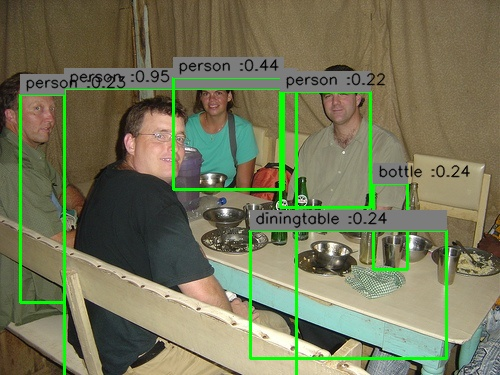
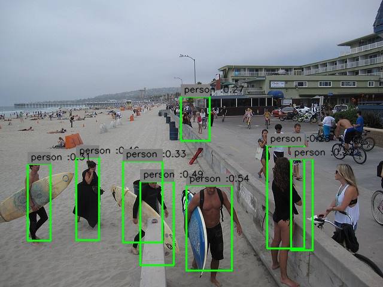

# YOLOv1
[预训练模型](https://drive.google.com/open?id=0B5aC8pI-akZUNVFZMmhmcVRpbTA)

使用[模型](https://drive.google.com/open?id=1g9TjTun_ebRzoxub_i76wexcgWXw5LIU)预测结果如下：
* VOC2007
 

* COCO

# YOLOv2
[Box-Clustering](https://nbviewer.jupyter.org/github/guker/tensorflow-home/blob/master/yolo/Box-Clustering.ipynb)
